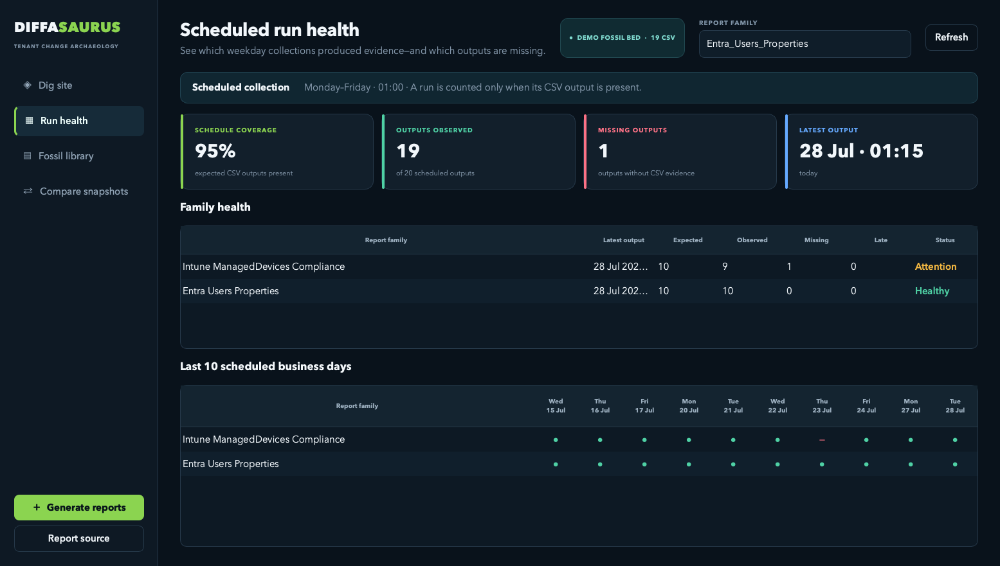

# Diffasaurus

> Your tenant has a past. Dig it up.

Diffasaurus is a standalone Microsoft 365 historical reporting
workbench. CSV snapshots are its database: it groups dated reports into
families, rebuilds dashboard metrics over time, and explains every added,
removed, or changed identity, device, role, group, application, access package,
or mailbox.

It is read-only by design when exploring history and does not require a
database server, cloud service, or connection to the original Coco365 project.



## Core views

- **Dig site** charts every supported tenant metric across dated snapshots.
- **Run health** checks the expected Monday-to-Friday 01:00 collection cycle
  against CSV files actually observed during the last 10 business days.
- **Fossil library** provides a searchable inventory of the snapshot database.
- **Compare snapshots** exposes added, removed, changed, and stable records,
  with field-level before/after values and CSV export.

Run health deliberately reports output evidence. A missing CSV means that no
successful output was observed; it does not attempt to infer the internal state
of an external scheduler.

## Run from source

Python 3.11 or newer and PowerShell 7 are recommended.

```bash
python3 -m venv .venv
source .venv/bin/activate
python3 -m pip install -r requirements.txt
python3 run.py
```

On Windows, activate the environment with `.venv\Scripts\activate`.

## CSV database

Newly generated reports are stored in `reports/`. Use **Report source** inside
the app to analyze another local, OneDrive, or SharePoint-synchronized folder
without copying its CSV files.

Large synchronized libraries are indexed lazily: Diffasaurus first reads only
filenames and timestamps, then analyzes the selected report family on a
background thread. The interface remains usable while OneDrive retrieves any
online-only files, with live progress for indexing and analysis. Completed
snapshot metrics and recent comparison counts are stored incrementally in a
local SQLite cache and reused after restarting Diffasaurus or relocating the
report folder; a CSV is analyzed again automatically when its size or
modification time changes. Long timelines can be limited to a trailing date
range and automatically summarized by week or month, while current-value cards
continue to use the original snapshot values. Schema changes are highlighted
alongside the timeline. For the fastest first analysis of a family, mark its CSV
files as **Always keep on this device** in OneDrive.

File names must end in a timestamp such as:

```text
Entra_Users_Properties_20260610-041113.csv
Intune_Devices_Autopilot_20260610_044056.csv
```

## Generate reports

The included scripts require PowerShell 7 and the Microsoft Graph PowerShell
modules required by each report. **Generate reports** detects PowerShell from
the current path, the login shell, Homebrew, Microsoft, and standard
platform-specific installation locations—even when a packaged macOS app does
not inherit the Terminal path.

Use **Manage runtimes** to inspect detected versions and architectures, choose
the active version, or import an extracted portable PowerShell distribution by
selecting its `pwsh` or `pwsh.exe`. Import, removal, and rescans run in the
background so large runtimes do not freeze the interface. Imported runtimes are
copied into Diffasaurus application data and can be removed independently. The
selected runtime is remembered.

Every runtime has its own private module directory and analysis cache. Normal
CurrentUser, AllUsers, and other-version module locations are deliberately
hidden during report execution. Open **Modules & console** to:

- inspect and remove modules belonging only to the selected runtime;
- install a specific module and optional exact version;
- install the Microsoft Graph and Exchange Online report modules; and
- use a persistent embedded console backed by the exact selected `pwsh`.

This isolation means a newly added runtime starts with no private report
modules, even if another PowerShell installation already has them. Install the
required modules separately for every runtime you want to test. PowerShell's
own built-in modules remain available.

The report list marks expected business-day snapshots that are absent, and
**Select missing** can rerun only those reports into the active local,
OneDrive, or SharePoint-synchronized CSV folder.

## Build a distributable application

Install the build dependencies, then run PyInstaller on the target operating
system:

```bash
python3 -m pip install -r requirements-build.txt
pyinstaller --clean Diffasaurus.spec
```

The result is created in `dist/Diffasaurus/`. Build separately on macOS
and Windows; PyInstaller applications are platform-specific.

### Windows portable archive

Run the Windows build from PowerShell:

```powershell
./scripts/build_windows.ps1
```

The resulting archive is written to
`release/Diffasaurus-<version>-Windows-x64.zip`. Packaged Windows builds keep
settings, caches, generated reports, portable runtimes, and isolated runtime
module environments under
`%LOCALAPPDATA%\Diffasaurus`. The GitHub Actions workflow named
**Windows portable build** can also be started manually and uploads the archive
as a workflow artifact. Signing is intentionally deferred for the preview
phase.

### macOS disk image

On macOS, the build also creates `dist/Diffasaurus.app`. Package it as a
compressed disk image with:

```bash
scripts/build_macos.sh
```

The resulting Apple-silicon image is written to
`release/Diffasaurus-<version>-macOS-arm64.dmg`. Packaged macOS builds keep local
settings, caches, generated reports, portable runtimes, and isolated runtime
module environments under
`~/Library/Application Support/Diffasaurus`, never inside the signed app bundle.

For normal Gatekeeper acceptance outside the Mac App Store, set
`DIFFASAURUS_SIGN_IDENTITY` to a **Developer ID Application** identity and
`DIFFASAURUS_NOTARY_PROFILE` to an `xcrun notarytool` keychain profile before
running the script. Without those credentials the build is ad-hoc signed for
local testing only and should be published as a preview, not as a trusted
production installer.

## Publishing on GitHub

The `.gitignore` excludes tenant CSV data, local settings, portable runtimes,
and PowerShell modules by default. Never commit real tenant reports or
authentication material to a fork.

## Test

```bash
python3 -m unittest discover -s tests -v
```
