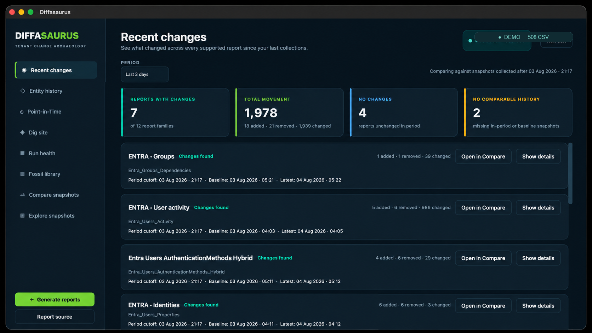

# Diffasaurus

> Your tenant has a past. Dig it up.

Diffasaurus is a local, cross-platform Microsoft 365 historical investigation
workbench. It reads dated CSV exports from Entra ID, Intune, Exchange, and
related admin reports—stored on disk, OneDrive, or SharePoint-synced folders—and
helps you chart tenant evolution, spot movement, compare snapshots, trace
entities, and reconstruct what was known at a chosen date. Exploring history is
read-only; it does not modify your tenant or require a cloud backend.

## How Diffasaurus gets its history

Diffasaurus is an investigation engine, not a historical Microsoft 365 API. It
does not query the tenant today and reconstruct the past from current state.
Historical answers come from **dated snapshots collected at that time** and
stored in the active report source.

Missing collections are missing evidence. Diffasaurus does not invent an
unchanged state when no snapshot exists for a period.

```
Microsoft 365 / Entra / Intune / Exchange
        ↓
scheduled or on-demand collectors
        ↓
dated snapshots
        ↓
SharePoint / OneDrive / local report source
        ↓
Diffasaurus
        ↓
historical investigation
```

**Collection modes**

1. **Generate reports** inside Diffasaurus (on-demand PowerShell exporters)
2. **Scheduled Azure Automation runbooks** (recommended for continuous history)
3. **Compatible exports** copied into the active report source

For useful long-term history, schedule recurring collection rather than relying
on one-off exports alone. See [Collection architecture](docs/collection-architecture.md)
and [Azure Automation collectors](collectors/azure-automation/README.md).


*Screenshots contain illustrative or anonymized data.*

### At a glance

- Historical tenant charts across dated snapshots
- Recent-change detection across report families
- Snapshot comparison with field-level diffs
- Entity history for users, devices, and shared mailboxes
- Point-in-Time reconstruction at a selected date
- Semantic Intune Configuration Policy history, settings, assignments, and diffs
- Local, read-only analysis—no database server required

## What administrators can answer

- What changed since the last collections?
- What did this user, device, or shared mailbox look like on a selected date?
- Which roles, groups, access packages, and authentication methods did the user have?
- Which Intune managed devices were associated with the user?
- Did a historical Windows device have a matching Autopilot record?
- Which CSV snapshot and field supports a value on screen?



*Recent Changes compares the latest snapshots in a look-back window against an earlier baseline.*

## Core workflows

**Recent Changes** — Movement across supported families for 24 hours through 30 days; summary cards and per-family detail, with links into Compare.

**Entity History** — Search a user, device, or shared mailbox; review changes across snapshots; open **View at date** for Point-in-Time.

**Point-in-Time** — See below.

**Dig site** — Chart supported metrics per report family; optional week/month aggregation and schema-change markers.

**Compare snapshots** — Added, removed, changed, and stable rows between two dated exports, with CSV export.

**Snapshot explorer** — Open any snapshot as a sortable table (search and multi-column filters) or an interactive dashboard; large files load in the background.

**Run health** — Weekday collection evidence for the last ten business days; a missing CSV means no observed output, not proof about an external scheduler.


*Run Health tracks weekday collection evidence across report families.*

**Fossil library** — Searchable list of snapshot files in the active report source.

**Configuration policies** — Dedicated Intune policy investigation from rich Phase 0
snapshot bundles (settings, assignments, coverage, and semantic history). Generate
reports can run the Configuration Policy exporter; it writes both an anchor CSV and
a compatible bundle directory. Recent Changes, Compare, Dig site, Fossil Library,
and Snapshot Explorer use semantic policy comparison—not generic CSV row diff—for
`Intune_ConfigurationPolicies`. Legacy pre-bundle exports are detected but not
automatically upgraded or trusted. Investigation is read-only; no live Graph calls.

## Point-in-Time

Select an entity and target date, then **Reconstruct**. Diffasaurus uses the
latest snapshot **at or before** that moment for each report family—never future
exports. Missing coverage is shown as missing evidence, not as a confirmed zero.
**Show source details** lists the CSV path, capture time, gap to your target, raw
fields, and reconstruction diagnostics.

**Users** receive an identity card with identity and organization; authentication
and activity; **managed devices** (compliance, hardware, ownership, expandable
details); historical **Autopilot** enrichment for applicable Windows devices;
roles; groups; and access packages. macOS, iOS, Cloud PCs, and virtual machines
identified in managed-device exports are not treated as missing Autopilot
registrations. Devices and shared mailboxes use layouts appropriate to those
entity types.

## How it works

1. **Generate or collect** dated snapshots (PowerShell scripts via **Generate
   reports**, scheduled automation runbooks, or copy exports into a folder).
2. **Select the report source** folder in the app (local, OneDrive, or
   SharePoint-synced).
3. **Investigate** charts, recent changes, entity history, and Point-in-Time
   locally.

**Historical source of truth**

- **Standard report families** — dated CSV files are the authoritative evidence.
- **Intune Configuration Policies** — the rich Policy Snapshot Bundle is the
  semantic source of truth; its top-level anchor CSV supports discovery and
  scheduling evidence only.

Diffasaurus builds derived local SQLite indexes and caches
(`config/entity_index/` and related paths) for responsiveness. These are
rebuildable from the snapshot artifacts—not authoritative history. Filename
timestamps follow patterns such as
`Entra_Users_Properties_20260610-041113.csv`.

## Generate reports

**Generate reports** runs PowerShell 7 scripts against Microsoft Graph,
Exchange Online, and other services as required per script. **Manage runtimes**
and **Modules & console** provide isolated module environments per selected
`pwsh`. **Select missing** can rerun absent expected snapshots into the active
folder.

## Run from source

Python 3.11+ and PowerShell 7 recommended.

```bash
python3 -m venv .venv
source .venv/bin/activate
python3 -m pip install -r requirements.txt
python3 run.py
```

On Windows: `.venv\Scripts\activate`

## Build

```bash
python3 -m pip install -r requirements-build.txt
pyinstaller --clean Diffasaurus.spec
```

Windows: `./scripts/build_windows.ps1` → `release/Diffasaurus-<version>-Windows-x64.zip`

macOS: `scripts/build_macos.sh` → `release/Diffasaurus-<version>-macOS-arm64.dmg`

Packaged apps store settings, caches, reports, and runtimes under the platform
application data location—not inside the bundle. Optional signing:
`DIFFASAURUS_SIGN_IDENTITY` and `DIFFASAURUS_NOTARY_PROFILE` for notarized macOS
builds.

## Privacy

Do not commit tenant CSVs, settings, caches, indexes, auth material, runtimes, or
identifiable screenshots. `.gitignore` excludes common paths (`reports/*.csv`,
`config/entity_index/`, `config/settings.json`, caches, `pwsh/`, `psmodules/`)
but is not a complete safety net—review before pushing.

## Project status

Feature-complete for its current scope. Further work focuses on fixes, report
compatibility, reliability, and maintenance.

## Test

```bash
python3 tools/run_unittests_isolated.py
```

Qt-heavy test modules run in separate Python processes to avoid cross-module
state accumulation.

Contributor checks:

```bash
git diff --check
python3 -m compileall diffasaurus tests tools run.py
```
