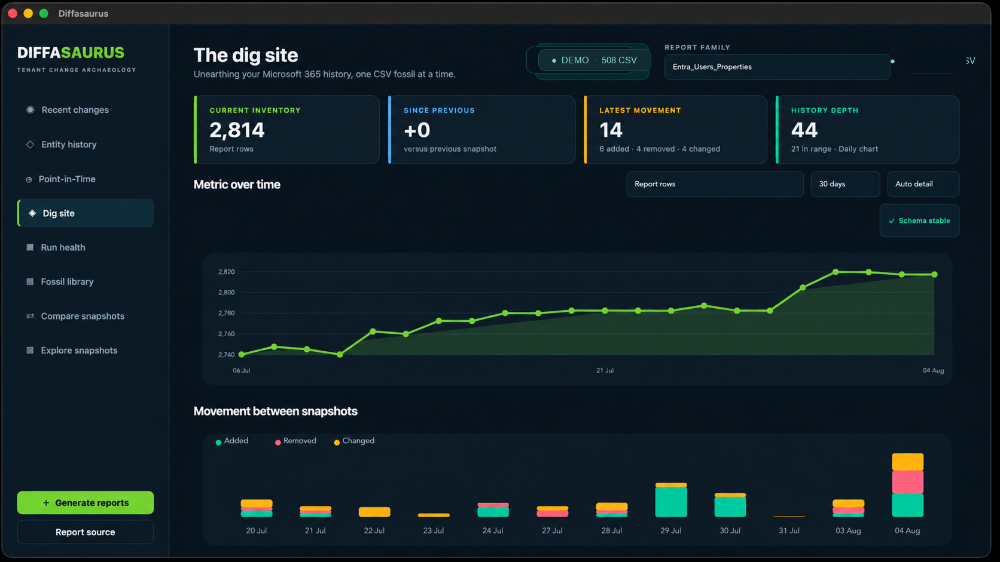

# Diffasaurus

> Your tenant has a past. Dig it up.

## Overview

Diffasaurus is a cross-platform Microsoft 365 historical reporting and
investigation workbench for Entra ID, Intune, Exchange, and related admin
reports. CSV snapshots are the source database: dated exports are grouped into
report families, indexed locally, and used to chart tenant evolution, compare
snapshots, surface recent movement, trace individual entities, and reconstruct
what was known at a selected historical date.

When you explore history, Diffasaurus is read-only. It does not modify your
tenant and does not require a database server or cloud backend. Analysis runs
against CSV files on disk (local folders, OneDrive, or SharePoint-synchronized
libraries).

Generating new reports is a separate, deliberate action. **Generate reports**
runs PowerShell collection scripts that authenticate to Microsoft Graph or
Exchange Online (and other services as required by each script) and write fresh
CSV files into your chosen report folder.



## What you can investigate

Diffasaurus helps administrators answer practical questions such as:

- How did users, devices, roles, groups, applications, access packages, and
  shared mailboxes change over time?
- What was added, removed, or changed between two snapshot dates?
- What changed recently across the report library?
- What did a specific user, device, or shared mailbox look like at a particular
  historical date?
- Which authentication methods, roles, memberships, access packages, and Intune
  managed devices were associated with that user at that time?
- For a Windows laptop at that date, was there a matching record in the
  historical Autopilot snapshot?
- Which CSV snapshot and field produced a value shown on screen?

## Core views

The sidebar lists the primary workspaces. Family-specific charts and tables on
older views use the report-family selector at the top; entity-centric views
(Recent changes, Entity history, Point-in-Time) use the full indexed library.

### Recent changes

Summarizes movement across supported report families for a selected look-back
period: **24 hours**, **48 hours**, **3 days**, **7 days**, **15 days**, or
**30 days**. For each family, Diffasaurus compares the latest snapshot in the
period against an earlier baseline snapshot at or before the period cutoff.

Summary cards show how many families changed, total added/removed/changed rows,
families unchanged, and families that could not be compared (for example when
no baseline exists or no snapshot was collected during the period). Per-family
sections list counts and let you open detailed comparisons or jump to **Compare
snapshots** for the selected pair.

### Entity history

Search for a **user**, **device**, or **shared mailbox** and inspect how that
entity appeared across compatible report families and snapshot dates. Identifiers
and aliases (UPN, mail, device IDs, serial numbers, and similar fields) are
reconciled where the report adapters support them.

Select a time window to review property and relationship changes observed during
that period. **View at date** opens **Point-in-Time** for the same entity at the
chosen target time.

Entity history and Point-in-Time rely on a persistent local entity index built
from your CSV library. The first open may trigger background indexing; progress
is shown in the entity search panel.

### Point-in-Time

Select an entity and a **requested target** date and time, then **Reconstruct**.
Diffasaurus builds the latest usable state from snapshots captured **at or
before** that target. Future snapshots are never used. Each report family can
contribute from a different snapshot time; the card and **Show source details**
explain which snapshot was used and how far it sits from your target.

Coverage distinguishes a missing snapshot from a snapshot that shows the entity
absent, and from ambiguous or incomplete association (for example unresolved
device-to-user links).

#### Historical user profile sections

For users, the identity card is organized as:

1. Identity
2. Organization
3. Authentication and activity
4. Managed devices
5. Roles
6. Groups
7. Access packages

User profiles can include:

- historical identity and organization properties;
- sign-in and activity fields where present in exports;
- registered authentication methods and related MFA/SSPR-oriented fields from
  authentication-method reports;
- role assignments, group memberships, and access-package assignments;
- Intune managed devices historically associated with the user;
- expandable per-device management, compliance, hardware, and identity details;
- Windows Autopilot enrichment when an applicable match exists in the historical
  Autopilot snapshot.

#### Managed devices and Autopilot

Each managed device appears as a compact row that expands to show grouped fields.
Large device lists offer a filter (device name, operating system, serial,
manufacturer, model).

For Windows devices, Autopilot enrichment is shown when relevant:

- **Matched** — a consistent Autopilot record was found in the selected snapshot;
  enrollment and assignment fields appear in the expanded device card.
- **Snapshot exists, no match** — Autopilot coverage exists at the target date,
  but no row matches the device’s stable identifiers; an informational note is
  shown (not a silent zero).
- **No Autopilot snapshot** — no Autopilot export at or before the target date.
- **Ambiguous** — conflicting or duplicate key matches; no single record is
  chosen.
- **Not applicable** — the device category is outside Autopilot matching (for
  example macOS, iOS, confirmed Cloud PC models, or virtual machines identified
  from managed-device exports). These devices do not show misleading
  “missing Autopilot” warnings on the main card; status and diagnostics remain
  available under **Show source details**.

**Show source details** exposes provenance for managed devices and Autopilot
independently (snapshot times, source files, linkage resolution, matching keys,
and raw sourced values).

Device and shared-mailbox Point-in-Time cards follow their own section layouts
and do not include the user managed-device block.

### Dig site

Charts supported tenant metrics across dated snapshots for the selected report
family. Long timelines can be summarized by week or month; schema changes are
highlighted along the timeline.

### Run health

Checks the expected weekday collection cycle against CSV files actually observed
during the last ten business days.

Run health reports output evidence. A missing CSV means no successful output was
observed; it does not infer the internal state of an external scheduler.

### Fossil library

Searchable inventory of discovered snapshot files: family, capture time, size,
and path within the active report source.

### Compare snapshots

Choose two dated exports from the same family to list added, removed, changed,
and stable rows, with field-level before/after values and CSV export.

### Snapshot explorer

Choose a report family, open **Explore snapshots**, then select any dated CSV.
Loading and dashboard calculation run in the background so large local,
OneDrive, and SharePoint-backed reports do not lock the window. You can also
double-click a Fossil library entry to open that exact snapshot.

The **Table** view provides:

- sortable rows and columns with horizontal exploration of wide schemas;
- debounced smart search across identity, device, group, and mailbox keys;
- an all-columns search option;
- an Excel-style **Multi-column filter** with searchable columns and values,
  check/uncheck-visible actions, blank-value handling, and combined conditions;
  and
- a persistent visible-row count and clear-filter state.

The **Dashboard** view recognizes identity, activity, authentication, group,
group-membership, role, device, iOS, Autopilot, Intune app, access-package, and
Exchange shared mailbox reports. Its cards are interactive: selecting a metric
opens the table with the matching rows filtered. Unknown CSV schemas receive a
generic data-quality dashboard covering row count, schema width, completeness,
and blank fields.

## Historical truth and coverage

Diffasaurus separates what the CSV evidence supports from what is unknown:

- **Snapshot used, entity present** — a report at or before the target contains
  the entity (or relationship rows that apply).
- **Snapshot used, entity absent** — the inventory report exists and does not
  list the entity at that time (a known empty result, not the same as missing
  data).
- **No snapshot at or before the target** — that report family cannot contribute
  for the requested date.
- **Ambiguous association** — for example conflicting device-to-user links or
  Autopilot key disagreement; the UI warns rather than guessing.
- **Enrichment unavailable** — managed-device or Autopilot enrichment failed;
  the base user card remains visible and the error is recorded in source details.

Missing evidence is not reported as a confirmed zero.

**Show source details** includes, per family where applicable:

- report family and CSV path;
- snapshot capture time and gap to the requested target;
- raw sourced scalar and relationship values;
- parsed authentication-method diagnostics;
- managed-device coverage, linkage kind, resolution status, and per-device
  properties;
- separate managed-device and Autopilot provenance and matching diagnostics.

## Local CSV database and persistent index

Newly generated reports are stored in `reports/` by default. Use **Report
source** inside the app to analyze another local, OneDrive, or SharePoint-
synchronized folder without copying its CSV files.

CSV files remain the source of truth. Diffasaurus also maintains local SQLite
caches and entity indexes so large libraries stay responsive:

- filenames and timestamps are discovered first;
- report content is parsed and indexed in background workers;
- unchanged files are reused; changed families are refreshed selectively;
- entity observations, aliases, relationships, and user–device link projections
  are stored under `config/entity_index/` (derived data that can be rebuilt from
  CSVs);
- timeline metrics and comparison summaries may also be cached in
  `config/analysis_cache.json` and related SQLite files;
- the UI remains usable while indexing and analysis run, with progress shown for
  long operations.

Large synchronized libraries benefit from marking CSV files as **Always keep
on this device** in OneDrive so first analysis does not wait on online-only
files.

File names must end in a timestamp such as:

```text
Entra_Users_Properties_20260610-041113.csv
Intune_Devices_Autopilot_20260610_044056.csv
```

Supported entity-centric report families include Entra user properties and
activity, authentication methods, role assignments, group memberships, access
package assignments, Intune managed devices, Autopilot devices, iOS devices, and
Exchange shared mailboxes—each mapped to user, device, or shared-mailbox
reconstruction where applicable.

## Generate reports

The included scripts require PowerShell 7. Individual reports need the Microsoft
Graph or Exchange Online modules (and other dependencies) appropriate to that
script. **Generate reports** detects PowerShell from the current path, the login
shell, Homebrew, Microsoft, and standard platform-specific installation
locations—even when a packaged macOS app does not inherit the Terminal path.

Use **Manage runtimes** to inspect detected versions and architectures, choose
the active version, or import an extracted portable PowerShell distribution by
selecting its `pwsh` or `pwsh.exe`. Import, removal, and rescans run in the
background so large runtimes do not freeze the interface. Imported runtimes are
copied into Diffasaurus application data and can be removed independently. The
selected runtime is remembered.

Every runtime has its own private module directory and analysis cache. Normal
CurrentUser, AllUsers, and other-version module locations are deliberately
hidden during report execution. The runtime manager reports both **Isolated**
modules available to Diffasaurus and **Installed** modules detected in normal
PowerShell user and machine locations. Built-in modules are excluded from both
counts because they are always supplied by the selected runtime.

Open **Modules & console** to:

- inspect and remove modules belonging only to the selected runtime;
- inspect modules already installed for that PowerShell and copy selected
  versions—or the complete inventory—into its isolated environment;
- install a specific module and optional exact version;
- install the Microsoft Graph and Exchange Online report modules; and
- use a persistent embedded console backed by the exact selected `pwsh`.

This isolation means a newly added runtime starts with no private report
modules, even if another PowerShell installation already has them. Install the
required modules separately for every runtime you want to use. PowerShell's
own built-in modules remain available.

The report list marks expected business-day snapshots that are absent, and
**Select missing** can rerun only those reports into the active local,
OneDrive, or SharePoint-synchronized CSV folder.

## Run from source

Python 3.11 or newer and PowerShell 7 are recommended.

```bash
python3 -m venv .venv
source .venv/bin/activate
python3 -m pip install -r requirements.txt
python3 run.py
```

On Windows, activate the environment with `.venv\Scripts\activate`.

## Build a distributable application

Install the build dependencies, then run PyInstaller on the target operating
system:

```bash
python3 -m pip install -r requirements-build.txt
pyinstaller --clean Diffasaurus.spec
```

The result is created in `dist/Diffasaurus/`. Build separately on macOS
and Windows; PyInstaller applications are platform-specific.

### Windows portable archive

Run the Windows build from PowerShell:

```powershell
./scripts/build_windows.ps1
```

The resulting archive is written to
`release/Diffasaurus-<version>-Windows-x64.zip`. Packaged Windows builds keep
settings, caches, generated reports, portable runtimes, and isolated runtime
module environments under
`%LOCALAPPDATA%\Diffasaurus`. The GitHub Actions workflow named
**Windows portable build** can also be started manually and uploads the archive
as a workflow artifact. Signing is intentionally deferred for the preview
phase.

### macOS disk image

On macOS, the build also creates `dist/Diffasaurus.app`. Package it as a
compressed disk image with:

```bash
scripts/build_macos.sh
```

The resulting Apple-silicon image is written to
`release/Diffasaurus-<version>-macOS-arm64.dmg`. Packaged macOS builds keep local
settings, caches, generated reports, portable runtimes, and isolated runtime
module environments under
`~/Library/Application Support/Diffasaurus`, never inside the signed app bundle.

For normal Gatekeeper acceptance outside the Mac App Store, set
`DIFFASAURUS_SIGN_IDENTITY` to a **Developer ID Application** identity and
`DIFFASAURUS_NOTARY_PROFILE` to an `xcrun notarytool` keychain profile before
running the script. Without those credentials the build is ad-hoc signed for
local testing only and should be published as a preview, not as a trusted
production installer.

## Privacy and safe publishing

Do not commit tenant CSV reports, local settings, analysis caches, entity
indexes, authentication material, portable PowerShell runtimes, isolated module
environments, or screenshots that contain identifiable tenant data to a public
repository.

The `.gitignore` excludes common sensitive paths by default, including
`reports/*.csv`, `config/settings.json`, `config/analysis_cache.json`,
`config/entity_index/`, SQLite cache files, `pwsh/`, `psmodules/`, and
`powershell-environments/`. Treat `.gitignore` as a helper, not a guarantee that
every sensitive file pattern is blocked—review changes before you push.

## Project status

Diffasaurus is feature-complete for its current scope. Ongoing work focuses on
bug fixes, report compatibility, reliability, and maintenance rather than major
new features.

## Test

```bash
python3 -m unittest discover -s tests -v
```

Before committing documentation or code changes, you may also run:

```bash
git diff --check
python3 -m compileall diffasaurus tests run.py
```
