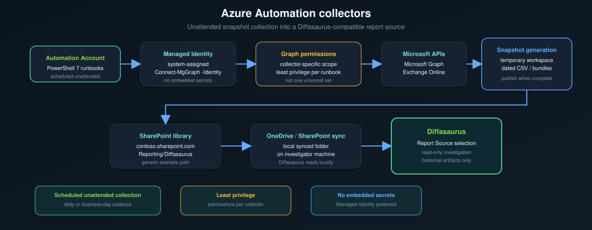

# Azure Automation collectors

## Purpose

Unattended, recurring collection of Diffasaurus-compatible snapshots. Scheduled
runbooks preserve historical evidence that manual or ad hoc exports cannot
provide at scale.

Diffasaurus itself does not run these jobs; it reads the artifacts they publish
into the active report source.

## Recommended design



Use **PowerShell 7** runbooks in Azure Automation. Authenticate with **Managed
Identity** where possible—no secrets embedded in scripts or this repository.

## Requirements

- Azure Automation account with **PowerShell 7+** runbooks
- `Microsoft.Graph.Authentication` (and modules required by each collector)
- **System-assigned Managed Identity** on the Automation account
- **Microsoft Graph application permissions** required by each collector script
- **SharePoint** write permission if publishing directly to a document library

There is **no single universal Graph permission set**. Each collector declares
the permissions it needs (users, groups, Intune policies, Exchange, and so on).
Grant least privilege per runbook.

## Authentication

Generic pattern:

```powershell
Connect-MgGraph -Identity -NoWelcome
```

Use Managed Identity in Azure Automation. Do not store client secrets in runbook
variables committed to source control.

Exchange Online or other modules may require additional connection steps per
collector; follow each script’s documented prerequisites.

## Output destination

Publish completed artifacts to a folder that syncs to the machine where
Diffasaurus runs, for example:

```
contoso.sharepoint.com
/sites/IT
Documents
Reporting/Diffasaurus
```

In Diffasaurus, set **Report Source** to the local synced path (for example
`~/OneDrive - Contoso/Reporting/Diffasaurus` or an equivalent platform path).

Use generic placeholder names in documentation and examples. Do not commit real
tenant domains, site URLs, or internal folder names.

## Scheduling

One runbook per report family or per logical collector is typical. Schedule:

- **daily** for broad coverage, or
- **business days only** when weekday evidence is sufficient

Align schedules with Run Health expectations and change-detection windows in
Diffasaurus (24 hours through 30 days).

## Publication safety

Collectors should write **complete** artifacts before they become visible as
successful collection evidence.

**Standard CSV families** — write the final CSV only after export content is
complete.

**Configuration Policies** — publish in dependency order:

1. child bundle files (inventory, per-policy JSON, filters, diagnostics)
2. `snapshot_manifest.json`
3. top-level **anchor CSV** last

The anchor marks discovery/scheduling evidence; an anchor without a readable
bundle must not be treated as a healthy semantic snapshot.

## Security

- **Least privilege** — grant only the Graph and SharePoint permissions each
  runbook requires
- **Managed Identity preferred** over stored credentials
- **No secrets in the repository** — use Automation variables or Key Vault
- **Sanitize examples** — generic domains and paths only
- **Do not commit tenant exports** — CSV bundles, policy JSON, or real IDs
- **Review permissions regularly** — Graph and SharePoint access should match
  current collector scope

## Troubleshooting

Checklist when a scheduled run does not produce expected Diffasaurus evidence:

- [ ] System-assigned Managed Identity enabled on the Automation account
- [ ] Required PowerShell modules imported in the Automation account
- [ ] Graph **application permissions** granted and **admin consent** applied
- [ ] SharePoint library access for the service principal / managed identity
- [ ] Runbook output path matches the synced report source location
- [ ] Timestamped artifacts appear after the run (CSV and/or policy bundle)
- [ ] For Configuration Policies: bundle directory complete before anchor CSV
- [ ] Diffasaurus **Report Source** points at the synced destination folder
- [ ] Diffasaurus **Refresh** run after new files sync locally

## Repository layout

Collector documentation lives under:

```
collectors/
  azure-automation/
    README.md
```

On-demand exporters used from the Diffasaurus app remain in `psscripts/`. This
folder documents the **recommended unattended collection pattern**; it does not
duplicate the full exporter catalog.
