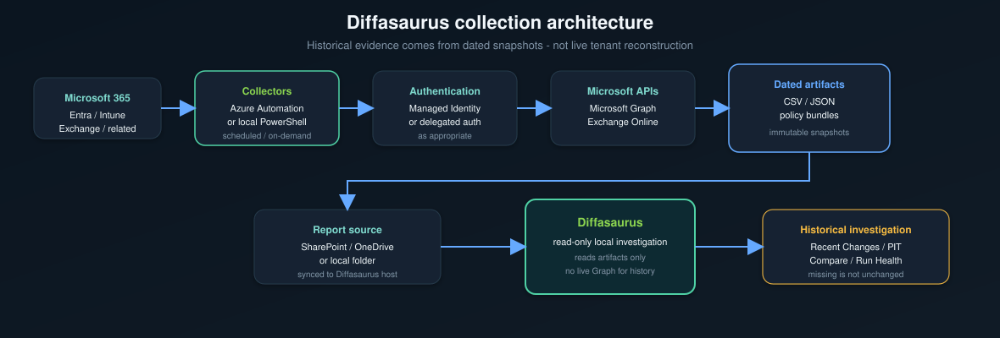

# Collection architecture

This document explains how Diffasaurus obtains historical evidence. It is
independent of the main README and describes the collection model, not UI
workflows.

## Why snapshots are required

Many Microsoft 365 administrative surfaces—Entra ID, Intune, Exchange Online,
and related admin reports—primarily expose **current state** through APIs and
portals. Administrative objects change over time; without preserved captures,
later investigation cannot answer what was true on a past date.

Diffasaurus preserves history by **collecting snapshots over time** and treating
each capture as immutable evidence. Investigation is read-only: Diffasaurus
does not call Graph during historical exploration and does not modify the
tenant.

## High-level architecture



Collectors run on a schedule or on demand. Artifacts land in a report source
folder that Diffasaurus reads locally (including OneDrive- or SharePoint-synced
paths).

## Collector responsibilities

A collector should:

- authenticate to the required services
- retrieve source state at collection time
- timestamp the capture deterministically
- preserve stable identifiers (for example user IDs, device IDs, policy keys)
- write artifacts in the format and layout Diffasaurus expects
- publish complete outputs into the active report source
- **never** silently turn retrieval failure into known-zero or “unchanged” data

Partial or failed exports must remain visibly incomplete or absent—not
reinterpreted as successful empty state.

## Snapshot responsibilities

Each snapshot is:

- **immutable historical evidence** — a point-in-time record, not a live view
- **timestamped** — filename and/or embedded manifest fields identify when
  capture occurred
- **contract-bound** — each report family has an expected schema or bundle layout
- **free of future-looking enrichment** — no use of later exports to backfill
  earlier semantic state

Point-in-Time and comparison logic use only snapshots **at or before** the
target moment.

## Report source

Diffasaurus reads from a single **active report source** selected in the app.
Supported storage patterns include:

- a local folder
- a OneDrive-synced folder
- a SharePoint document library synced to the machine running Diffasaurus

The app does not require a cloud backend; it reads whatever is present on disk
at the configured path.

## Configuration Policies special case

Most standard report families produce a **dated CSV** per collection:

```
Entra_Users_Properties_20260610-041113.csv
```

**Intune Configuration Policies** produce two related artifacts with the same
snapshot identity:

1. **Anchor CSV** — top-level file for report-family discovery and scheduling
   evidence, for example:
   `Intune_ConfigurationPolicies_20260813-130300.csv`

2. **Rich snapshot bundle** — directory with the same stem, for example:
   `Intune_ConfigurationPolicies_20260813-130300/`

The bundle is the **semantic source of truth** for policy settings, assignments,
coverage, normalization, and diffs. The anchor CSV is not used for row-by-row
semantic comparison.

A compatible bundle typically includes:

- `snapshot_manifest.json` — capture metadata and export status
- `inventory.csv` — policy inventory index
- `assignment_filters.json` — filter definitions captured with the snapshot
- `retrieval_diagnostics.json` — per-source retrieval evidence (when present)
- platform/source policy JSON files — per-policy semantic payloads

Legacy pre-bundle export layouts are detected but not automatically upgraded or
trusted as modern semantic snapshots.

## Missing collection semantics

```
No snapshot at a point in time
        ≠
"nothing changed"
```

It means:

```
Diffasaurus has no evidence for that collection point.
```

Recent Changes, Run Health, and Point-in-Time surfaces distinguish **missing
evidence** from **observed unchanged** state. Do not infer stability from
absence of files.

## Recommended cadence

Collection frequency depends on operational needs. Many environments use:

- **daily** or **business-day** scheduled runs for core report families
- on-demand collection before major changes or audits

More frequent collection improves resolution of short-lived changes. Diffasaurus
does not guarantee detection of changes between collections—only comparison of
snapshots that exist.

For unattended recurring collection, see
[Azure Automation collectors](../collectors/azure-automation/README.md).
